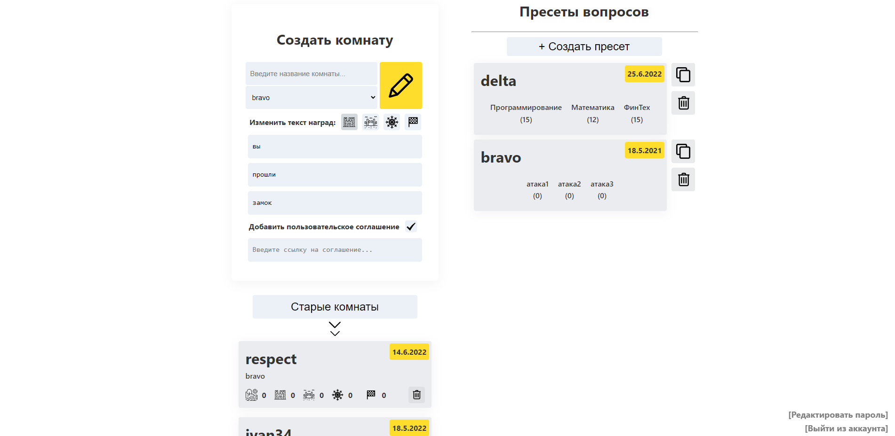
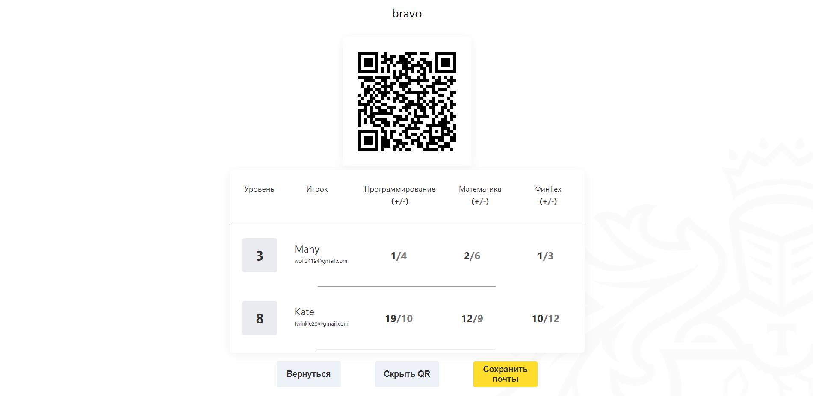
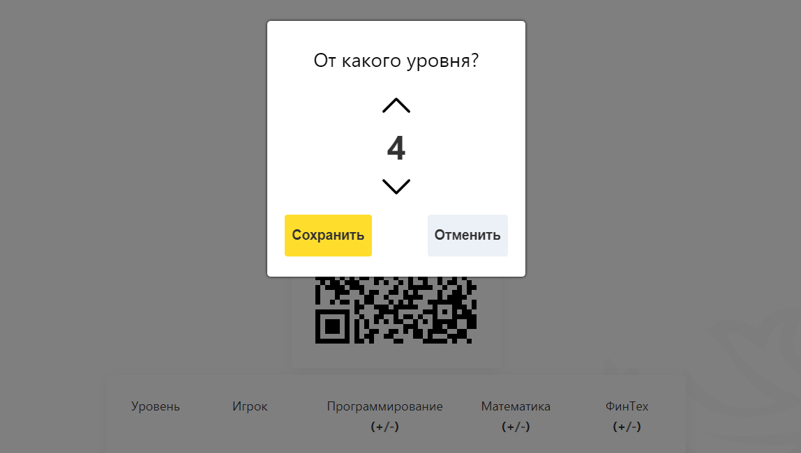
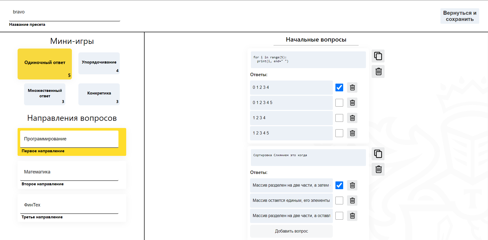

# T-Quest | admin web-page

Website for the admin of the T-Quest game to moderate it.

___
## Description

Intellectual game T-Quest consist of different test-questions that need to be created/modified. For this reason 
admin of the game needs this web-site, where he has all necessary functionality. For example,
storing leaderboards of players inside one room, creating presets of questions with later modification of them, 
managing presets/rooms, etc. More detailed description of each page provided in next section below

___
## Login page
Ordinary login page needed for different admins preventing access of everyone to website 

## Main Page
In this main page admin able to go to other 2 pages or exit pressing button in the bottom.  
On the left side admin can create new room, hide/show old rooms (pressing 'Старые комнаты' button),
go to created rooms or delete them.  
On the right site there is ability to create new preset (pressing '+ Создать пресет' button), copy/delete 
existing presets or go to their page for modification by clicking on them.

## Room Page
In this page admin can track progress of players, hide/show QR-code
directing to game with this room's setup.

Also admin can save mails of players on his clipboard
with filter on their level:

## Preset page
On this page admin can create test-questions that players will see in the game.
On the left site admin can name attack types simultaneously clicking in this field
to assign questions to this attack type. Also there are 4 types of questions that also 
can be chosen while creating questions and number of questions of such question type for chosen attack type are written
in the corner.  
On the right there is field for creating/copying/ deleting questions. Inside question box
admin able to modify question, add/del/edit answers and all of them are validated, so invalid answer
won't be sent on server.

*Questions with all metadata stored locally using localStorage in order to make less server requests*

___
## Available Scripts

### `npm start`

Runs the app in the development mode.\
Open [http://localhost:3000](http://localhost:3000) to view it in your browser.

The page will reload when you make changes.\
You may also see any lint errors in the console.

### `npm test`

Launches the test runner in the interactive watch mode.\
See the section about [running tests](https://facebook.github.io/create-react-app/docs/running-tests) for more information.

### `npm run build`

Builds the app for production to the `build` folder.\
It correctly bundles React in production mode and optimizes the build for the best performance.

The build is minified and the filenames include the hashes.\
Your app is ready to be deployed!

See the section about [deployment](https://facebook.github.io/create-react-app/docs/deployment) for more information.